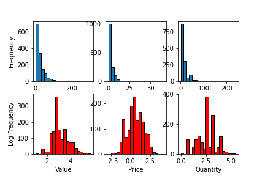
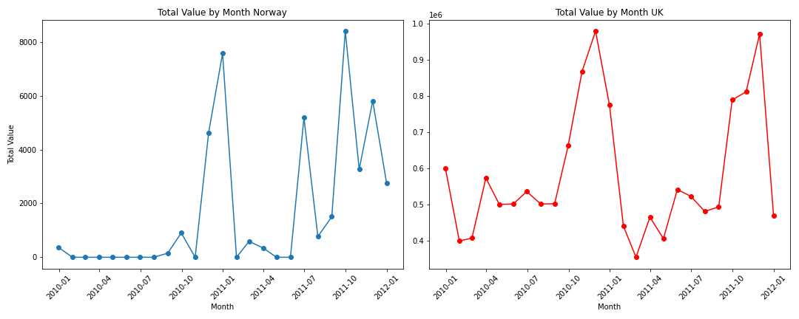
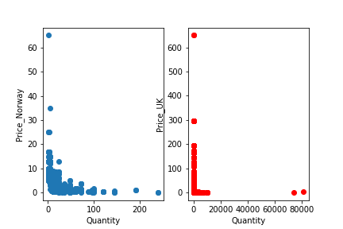

📊 Visualizations

1. Distribution Analysis
	•	Histograms of Value, Price, and Quantity.
	•	Both frequency and log-frequency plots are included.
	•	Highlights the skewness of transaction values and quantities.
  
2. Sales Trends by Country
	•	Time-series line plots of total transaction value by month.
	•	Comparison between Norway and the UK.
	•	Shows clear seasonal patterns and spikes in sales.
  
3. Price vs. Quantity
	•	Scatter plots of Price vs. Quantity for Norway and the UK.
	•	Illustrates the concentration of purchases around low prices and small quantities, with a few high-value outliers.
  
🛠️ Technologies Used
	•	Python 3
	•	Pandas for data manipulation
	•	Matplotlib / Seaborn for visualization
	•	Jupyter Notebook for interactive analysis

├── data/                 # (not included, requires Online Retail II dataset)
├── notebooks/            #  analysis
├── plots/                # Exported figures
│   ├── Norway_value.png
│   ├── UK_Norway_time.png
│   └── UK_Norway.png
├── README.md             # Project documentation
